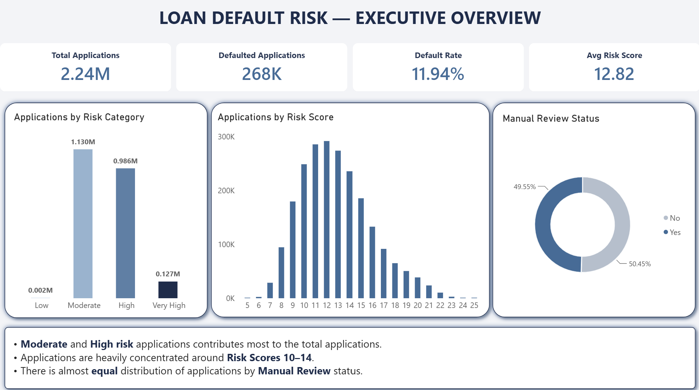
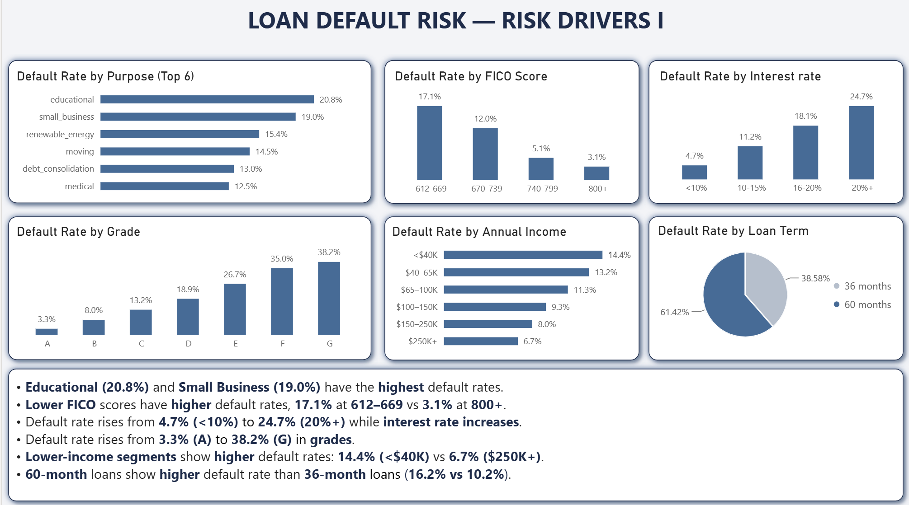
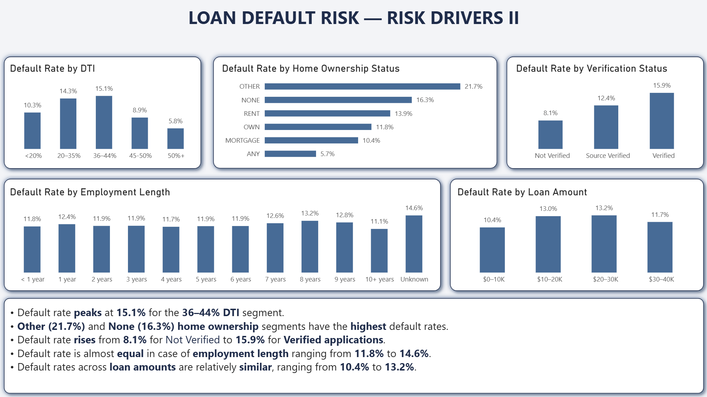
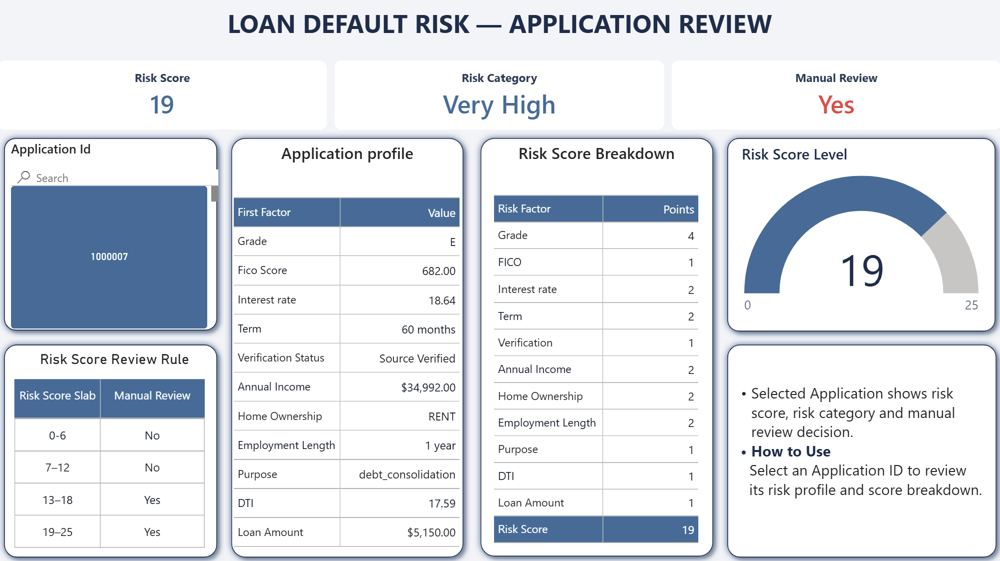

# Loan Default Risk Analysis

## 📌 Project Overview

This project analyzes historical loan applications to identify factors associated with loan defaults and create a rule-based risk scoring system for manual review.

---

## 🎯 Business Question

**Which customer segments have the highest loan default probability, and which applications should the credit team manually review?**

---

## 📸 Dashboard Preview






---

## 🛠️ Tools & Technologies

| Tool | Purpose |
|---|---|
| **Python / Pandas** | Data loading, cleaning and feature preparation |
| **MySQL** | SQL-based analysis |
| **Power BI** | Dashboard |
| **DAX** | Risk scoring, risk categories and manual-review logic |

---

## Analysis

Key risk factors analyzed:

- Grade
- FICO Score
- Interest Rate
- Annual Income
- Loan Term
- Verification Status
- Home Ownership
- Employment Length
- Loan Purpose
- DTI
- Loan Amount

---

## 🔄 Project Workflow

```text
Raw CSV
   ↓
Python / Pandas
   ↓
Data Cleaning & Feature Preparation
   ↓
Cleaned Dataset
   ↓
MySQL
   ↓
Default Rate & Segment Analysis
   ↓
Risk Scoring Framework
   ↓
Visualization
```

## Risk Scoring

A rule-based score from **0–25** was created using observed historical default rates.

| Risk Score | Category | Manual Review |
|---|---|---|
| 0–6 | Low Risk | No |
| 7–12 | Moderate Risk | No |
| 13–18 | High Risk | Yes |
| 19–25 | Very High Risk | Yes |

## 📊 Key Findings

- Overall default rate: **11.94%**
- Grade G had the highest default rate: **38.2%**
- FICO 612–669 had a **17.1%** default rate.
- Interest rates of 20%+ had a **24.7%** default rate.
- Lower-income segments showed higher default rates.
- **Educational (20.8%)** and **Small Business (19.0%)** have the **highest** default rates.
- **60-month** loans show a **higher** default rate than **36-month** loans (**16.2% vs 10.2%**).
- Default rate **peaks** at **15.1%** for the **36–44% DTI** segment.
- **Other (21.7%)** and **None (16.3%)** **home ownership** segments have the **highest** default rates.
- Default rate **rises** from **8.1%** for **Not Verified** to **15.9%** for **Verified** applications.
- Default rate is almost **equal** across **employment length**, ranging from **11.8% to 14.6%**.
- Default rates across **loan amounts** are relatively **similar**, ranging from **10.4% to 13.2%**.

---

## 🗂️ Project Files
| File | Description |
|---|---|
| `loan_default_risk_analysis.ipynb` | Python notebook |
| `loan_default_risk_analysis.sql` | SQL queries |
| `dashboard.pbix` | Interactive dashboard |
| `dashboard_image1.png` | Dashboard Page 1 - EXECUTIVE OVERVIEW|
| `dashboard_image2.png` | Dashboard Page 2 - RISK DRIVERS I|
| `dashboard_image3.png` | Dashboard Page 3 - RISK DRIVERS II|
| `dashboard_image4.png` | Dashboard Page 4 - APPLICATION REVIEW|
| `presentation.ppt` | Presentation|


---

## 🎯 Skills Demonstrated

- **Python & Pandas** — Data cleaning, transformation and feature engineering
- **SQL / MySQL** — Data loading and querying
- **Power BI** — Data modeling, DAX, interactive dashboards, KPIs, and slicers
- **Risk Analysis** — Default-rate analysis and customer risk segmentation
- **Risk Scoring** — Rule-based risk scoring and manual-review classification
- **Data Visualization** — Business-focused dashboards and visual storytelling
- **Analytical Thinking** — Identifying and interpreting key risk drivers

---

## 🎯 Final Takeaway

This project demonstrates how historical loan data can be transformed into actionable risk insights using **Python, MySQL, and Power BI**. The analysis identified key factors associated with higher default rates and translated these findings into a **rule-based risk scoring system** for future applications and make manual application review decision.
